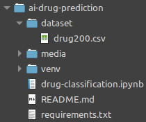

# Panduan Instalasi

## Requirements

- Versi Python >= 3.7
	- dicoba pertama kali menggunakan python versi 3.8.11

## Tahapan instalasi

- Menginstal virtual environment secara global
	- virtual environment bertujuan untuk mengisolasi dependency project sehingga tidak tumpang tindih dengan project yang lain

```bash
$ python -m pip install virtualenv
```

- Membuat virtual environment

```bash
$ python -m venv ./venv
```

- Aktivasi virtual environment

	- Di linux
	```bash
	$ source ./venv/bin/activate
	```

	- Di windows
	```shell
	$ .\venv\Scripts\activate.bat
	```

- Menginstall dependency

```bash
$ pip install -r requirements.txt
```

- Download dataset dari [kaggle Drug Classification](https://www.kaggle.com/prathamtripathi/drug-classification)
	- buat folder baru dengan nama `dataset`
	- ekstrak file zip yang baru didownload, kemudian copy file drug200.csv kedalam folder `dataset`
	

<br>

- Menjalankan aplikasi streamlit
```bash
$ streamlit run app.py
```